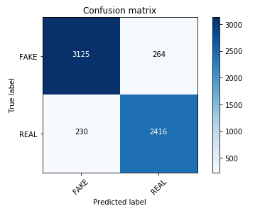
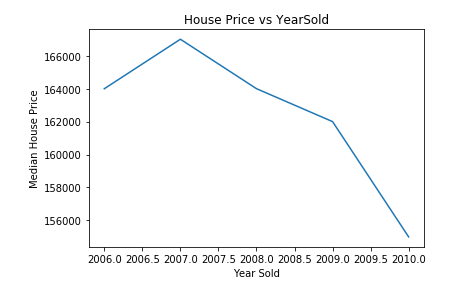
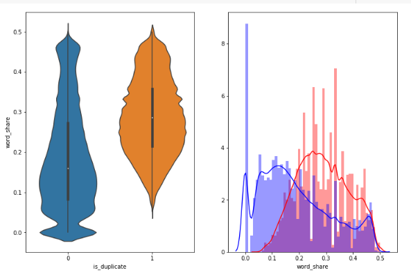
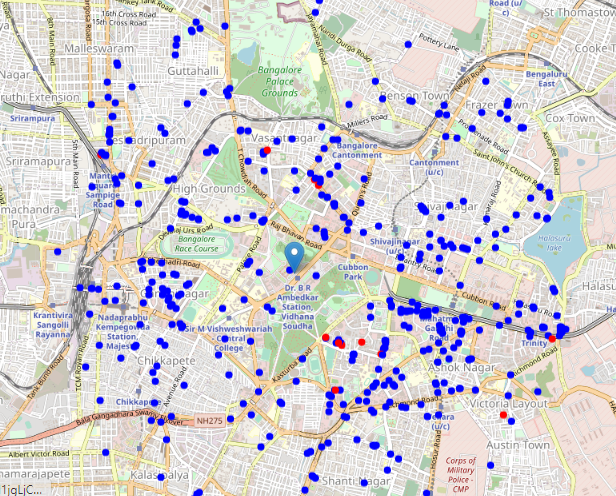

# Data Science and Big Data Portfolio

This portfolio contains different projects completed by me for academic, self learning and interest towards Data Science and Big Data.
In this repositoy i have done several projects , using different concepts, technologies and libraries.

For the more pleasant experience ,please check my online [portfolio](https://zaidhasib.github.io/DATA-SCIENCE-AND-BIG-DATA-PORTFOLIO/)

## Content

### Projects 

#### 1.[Fake News Classfier](https://github.com/Zaidhasib/DATA-SCIENCE-AND-BIG-DATA-PORTFOLIO/tree/master/Fake%20News%20Classifier)

  * Created the Fake News Classifier uisng NLP techniques like BOW, Tf-Idf , Word2Vec, and then classfiy the news that are passing as a     fake or a genuine news.
  
  * Libraries used : NLTK,Numpy,Pandas,Matplotlib,Sckit-Learn and Keras.Got an accuracy of 91%.
  

   

 
 
  
#### 2. [Housing Price Prediction](https://github.com/Zaidhasib/DATA-SCIENCE-AND-BIG-DATA-PORTFOLIO/tree/master/Housing%20Price%20Prediction)

  * Created a house price prediction model. Perofrmed EDA on the data set, feature selection , feature engineering. Tried different         algorithms like XGBRegressor, Linear_Regressor, OLS, and deep learning libraries.
  
  * Library used :Numpy,Pandas,Matplotlib,Sckit-Learn and Keras.
  

   

#### 3. [In depth Data Analysis on Airbnb data for New York area](https://github.com/Zaidhasib/DATA-SCIENCE-AND-BIG-DATA-PORTFOLIO/tree/master/Airbnb%20data%20analysis%20using%20Apache%20Spark)

  * Done data analysis of Airbnb data of April Month for New York area, performed severals transformation and action. Done EDA using         matplotlib and databricks in built plot functions. Used Spark Dataframe,Spark Sql,Spark UDF and many analytical function for             analysis.

#### 4. [Similar Question classifer on Quora datasets](https://github.com/Zaidhasib/DATA-SCIENCE-AND-BIG-DATA-PORTFOLIO/tree/master/Quora%20Similar%20Question%20Classifier)

   * Built a question classifier, which will  clasify whether the two questions are of same meaning or not. Used NLP techniques like          BOW, Tf-Idf , Word2Vec. Done features creation and features selection. For model creation used SGD. 
   
   * Libraries used : NLTK,Numpy,Pandas,Matplotlib,Sckit-Learn
   

   

#### 5. [Neighbourhood prediction for Italian Resturant in Banglore](https://github.com/Zaidhasib/DATA-SCIENCE-AND-BIG-DATA-PORTFOLIO/tree/master/Resturant%20Location%20Recommender)

  * Built an Neighbiurhood predictor in banglore area for New Italian Resturant in radius of 12 KM area. For the data extraction used       geopy,folium. Used foursquare api for getting the details of existing retsurants. Used K-Means algorithm for segmentation.
  
  * Libraries used : Numpy,Pandas,Matplotlib,Sckit-Learn,folium,geopy.
  

   

  

For more projects , Please visit my [github](https://github.com/Zaidhasib/) page

### Education

 Post Graduation Programme in Artificial Intelligence and Machine Learning
 
 BITS Pilani(2020-Present)    
 93.5% 

 Bachelor of Technology in Electronics and Electrical Engineering 
 
 KIIT University Bhubaneswar(2014-2018)  
 8.75 CGPA
 
 
 #### Online Courses and Certifications
 
   List of Online Courses and Certification that I completed to acquire knowledge and build my understanding on the subjects                related to big data and data science.
   
   * [Google Cloud Platform Big Data and Machine Learning Fundamentals by Google Cloud on Coursera](https://www.coursera.org/account/accomplishments/certificate/RFABJFD9WPQ2)
   
   * [IBM Data Science Professional Certificate by IBM on Coursera](https://www.coursera.org/account/accomplishments/specialization/certificate/EH2YT8YM9HEU)
   
   * [Deep Learning Specialization Certificate by deeplearning.ai on Coursera](https://www.coursera.org/account/accomplishments/specialization/certificate/XB2LZCFU62DT)
   
   * [IBM AI Engineering by IBM on Coursera](https://www.coursera.org/account/accomplishments/specialization/certificate/W4ZLG7MPLV9C)
   
   * [Introduction to Data Science by IBM on Coursera](https://www.coursera.org/account/accomplishments/specialization/certificate/726YBEXN7UEV)
   
   * [Microsoft Power BI Masters from Ineuron.ai](https://academy.ineuron.ai/certificates/downloads/PB008852.pdf)
   
   For checking more certificates and Courses done by me . Please Click [here](https://www.youracclaim.com/users/md-zaid-hasib)
   
   
### Contacts
   zaidhasib@gmail.com

 [LinkedIn](https://www.linkedin.com/in/md-zaid-hasib-878666102)

 

